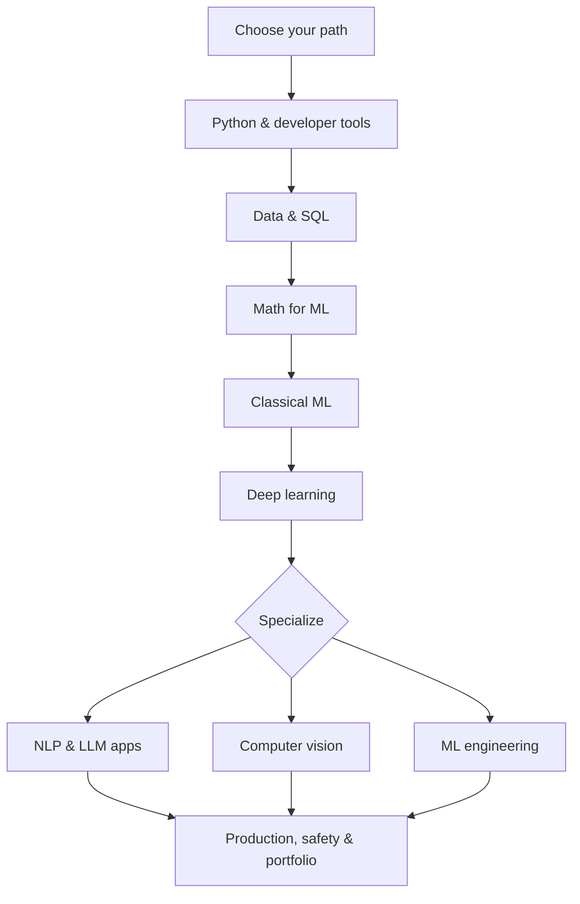

# Awesome Python, AI & ML Roadmap

> A project-first, role-aware path from Python foundations to production AI systems.

AI learning is often a pile of bookmarks. This repository turns carefully selected
resources into an ordered execution plan with exercises, checkpoints, portfolio
projects, and role-specific shortcuts.

## Who is this for?

| You are... | Start here | Suggested pace |
| --- | --- | ---: |
| New to programming | [Complete Beginner](paths/complete-beginner.md) | 9–12 months |
| A software engineer | [Software Engineer to AI Engineer](paths/software-engineer.md) | 5–7 months |
| A domain professional | [Domain Professional](paths/domain-professional.md) | 4–6 months |
| An ML/data practitioner | [ML Engineer to GenAI](paths/ml-practitioner.md) | 3–5 months |

The durations assume 7–10 focused hours per week. Move by demonstrated skill, not
calendar time.

## The roadmap

### Shared core

| Stage | Learn | Build | Guide |
| ---: | --- | --- | --- |
| 0 | Workflow, environment, Git, responsible AI | Reproducible starter repo | [Start here](roadmap/00-start-here.md) |
| 1 | Python, testing, APIs, clean code | CLI data utility | [Python foundations](roadmap/01-python-foundations.md) |
| 2 | NumPy, pandas, visualization, SQL | Exploratory data report | [Data foundations](roadmap/02-data-foundations.md) |
| 3 | Linear algebra, probability, calculus intuition | Algorithms from scratch | [Math for ML](roadmap/03-math-for-ml.md) |
| 4 | Supervised/unsupervised ML, evaluation | End-to-end prediction service | [Machine learning](roadmap/04-machine-learning.md) |
| 5 | Neural networks, PyTorch, transfer learning | Image or text classifier | [Deep learning](roadmap/05-deep-learning.md) |

### Specializations

| Track | Focus | Capstone |
| --- | --- | --- |
| [NLP, LLMs & GenAI](roadmap/06-llms-and-genai.md) | Transformers, prompting, RAG, evaluation, agents | Cited knowledge assistant |
| [Computer vision](roadmap/07-computer-vision.md) | Classification, detection, augmentation, evaluation | Visual inspection API |
| [MLOps & production AI](roadmap/08-mlops-production.md) | APIs, containers, tracking, CI, monitoring | Deployed, monitored ML service |
| [Portfolio & career](roadmap/09-portfolio-career.md) | Case studies, interviews, specialization proof | Interview-ready portfolio |

## How to use this repository

1. Pick one learner path above.
2. Create a learning log from [the template](guides/learning-log-template.md).
3. Complete the diagnostic tasks; skip only skills you can demonstrate.
4. At each stage, learn one concept and immediately implement it.
5. Do the checkpoint without copying a tutorial.
6. Publish the code, README, tests, results, limitations, and next steps.
7. Select a capstone from the [project ladder](projects/project-ladder.md).

Use AI assistants as a reviewer and tutor—not as a substitute for understanding.
Follow the [AI-assisted learning protocol](guides/ai-assisted-learning.md).

## Project ladder

The repository includes projects at four levels:

- **Starter:** Python automation, data cleaning, and exploratory analysis
- **Core:** tabular ML, NLP classification, recommender, time-series baseline
- **Applied:** RAG, vision inspection, forecasting, anomaly detection
- **Production:** tested API, container, CI, monitoring, model card, runbook

See [the complete project ladder](projects/project-ladder.md) and the
[end-to-end project standard](projects/project-standard.md).

## Resource philosophy

This is a curated route, not an internet dump. A resource should be:

- authoritative or exceptionally clear;
- runnable and maintained;
- legally accessible;
- tied to a specific outcome;
- replaceable when it becomes stale.

Official documentation is preferred. One primary resource and at most two useful
alternatives are selected per topic. See the [resource index](resources/index.md)
and [curation policy](resources/curation-policy.md).

## Recommended baseline stack

Python, Git, VS Code or JupyterLab, NumPy, pandas, SQL, scikit-learn, PyTorch,
Hugging Face, FastAPI, pytest, Docker, MLflow, and GitHub Actions. Tools are
introduced only when the learning outcome needs them.

## What “complete” means

No roadmap can contain all of AI, and fast-moving tools will change. This repository
aims to be a complete **navigation and practice system**: it tells you what to learn,
in what order, what to build, and how to prove the skill. Linked documentation,
courses, datasets, and repositories remain the source material.

## Contributing

Broken links, better exercises, accessibility improvements, and well-justified
resource replacements are welcome. Read [CONTRIBUTING.md](CONTRIBUTING.md).
Please do not submit large unranked lists, affiliate links, pirated material, or
resources without a clear learning outcome.

## License

Roadmap text is licensed under [CC BY 4.0](LICENSE). Linked resources and project
repositories retain their own licenses.
